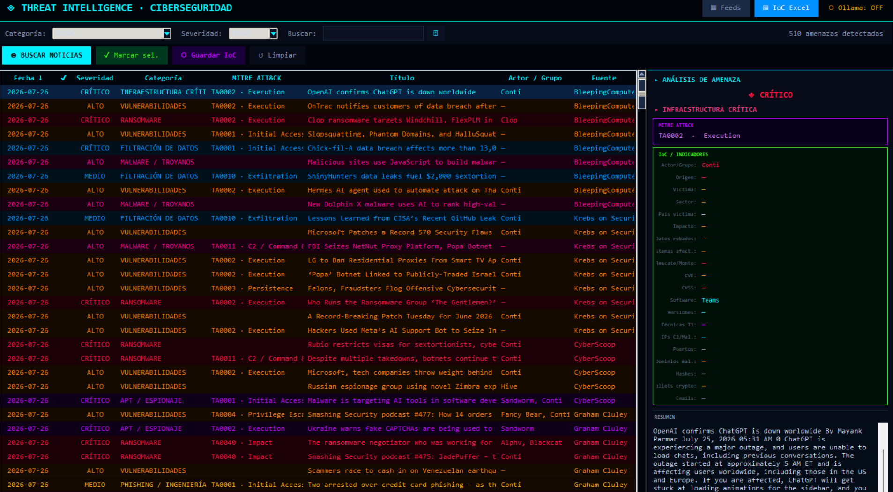
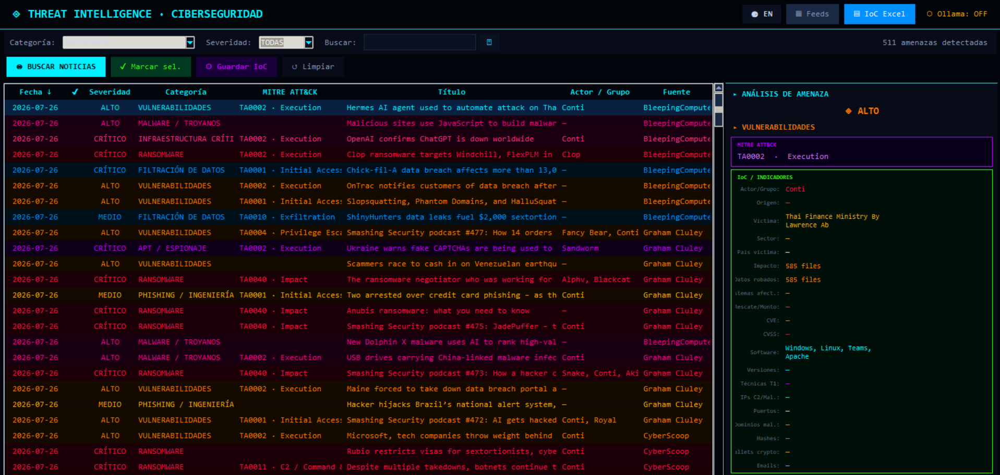
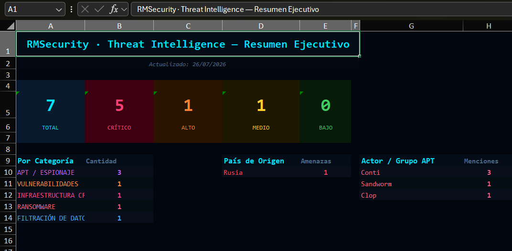
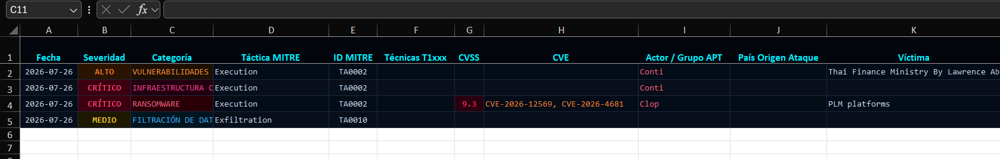

# RMSecurity — Cyber Threat Intelligence Tool

> Real-time cybersecurity threat monitoring with MITRE ATT&CK classification, IoC extraction, and automated Excel reporting.

Built by [Rodrigo Moses](https://www.linkedin.com/in/rodrigo-m-793b36152/) · Python · tkinter · Open Source

🌐 **[English](#english)** | **[Español](#español)**

---

---

<a name="english"></a>
## 🇺🇸 English

### What it does

RMSecurity monitors **47 RSS feeds** from leading cybersecurity sources (Krebs on Security, BleepingComputer, CISA, Unit 42, Recorded Future, The Hacker News, and more), classifies every article using **MITRE ATT&CK** tactics, extracts **Indicators of Compromise**, and exports everything to a color-coded Excel report.

### Features

- **MITRE ATT&CK classification** — maps each article to a tactic (TA0001–TA0043) and technique (T1xxx)
- **Automatic severity scoring** — CRITICAL / HIGH / MEDIUM / LOW based on keywords and CVSS score
- **IoC extraction** — CVEs, IP addresses (C2), MD5/SHA hashes, APT groups, victim organizations, affected countries, ransom amounts, data stolen, crypto wallets
- **50+ APT group detection** — Lazarus, Fancy Bear, Volt Typhoon, and more, with country-of-origin inference
- **Full article download** — fetches complete article text (not just RSS summaries) for deeper IoC extraction
- **Excel report with dashboard** — severity color-coding, category breakdown, executive summary sheet, clickable URLs
- **Optional Ollama integration** — connect a local LLM (llama3.2:3b) for semantic enrichment
- **Language toggle** — switch between English and Spanish with one click (🌐 EN/ES button)
- **Dark cyberpunk UI** — neon-on-dark theme built with tkinter

### Screenshots





| Excel report — severity colors | Excel report — IoC detail |
|---|---|
|  |  |

### Feed categories

| Category | Examples |
|---|---|
| RANSOMWARE | LockBit, BlackCat, RansomHub activity |
| VULNERABILITIES | CVEs, zero-days, patch releases |
| APT / ESPIONAGE | Nation-state campaigns |
| DATA BREACH | Breach reports, leak databases |
| MALWARE / TROJANS | New malware families, RATs, stealers |
| CRITICAL INFRASTRUCTURE | ICS/SCADA, energy, water |
| PHISHING / SOCIAL ENGINEERING | Campaigns, BEC, credential theft |
| CYBERCRIME / DARKWEB | Forums, marketplaces, threat actor chatter |

### Requirements

```
Python 3.9+
```

```bash
pip install feedparser requests openpyxl beautifulsoup4
```

Optional (LLM enrichment):
```bash
# Install Ollama from https://ollama.com
ollama pull llama3.2:3b
```

### Usage

```bash
python cyber_intel_gui.py
```

Or double-click `INICIAR_CYBER_INTEL.bat` on Windows.

### Compile to EXE

```bash
pip install pyinstaller
COMPILAR_CYBER.bat
```

Output: `EJECUTABLE\RMSecurity_CyberIntel.exe`

### How it works

1. **Search** — enter keywords (`ransomware`, `APT`, `CVE-2024`) and click **SEARCH**
2. **Results** — articles appear sorted by date, color-coded by severity and category
3. **Select & Export** — mark articles and click **Save IoC** to append to `THREAT_INTEL_IOC.xlsx`
4. **Dashboard** — Excel includes a `Resumen` sheet with counts by severity, category, and threat actor

> **Pro tip:** Leave it running in the background — it accumulates threat intelligence over time.

---

<a name="español"></a>
## 🇦🇷 Español

### Qué hace

RMSecurity monitorea **47 feeds RSS** de las principales fuentes de ciberseguridad (Krebs on Security, BleepingComputer, CISA, Unit 42, Recorded Future, The Hacker News y más), clasifica cada artículo usando tácticas de **MITRE ATT&CK**, extrae **Indicadores de Compromiso** y exporta todo a un reporte Excel con colores.

### Características

- **Clasificación MITRE ATT&CK** — mapea cada artículo a una táctica (TA0001–TA0043) y técnica (T1xxx)
- **Severidad automática** — CRÍTICO / ALTO / MEDIO / BAJO según keywords y score CVSS
- **Extracción de IoC** — CVEs, IPs (C2), hashes MD5/SHA, grupos APT, víctimas, países afectados, montos de rescate, datos robados, wallets crypto
- **Detección de 50+ grupos APT** — Lazarus, Fancy Bear, Volt Typhoon y más, con inferencia de país de origen
- **Descarga de artículos completos** — obtiene el texto completo (no solo el resumen RSS) para extracción más profunda
- **Reporte Excel con dashboard** — colores por severidad, tabla por categoría, hoja de resumen ejecutivo, URLs clickeables
- **Integración opcional con Ollama** — conectá un LLM local (llama3.2:3b) para enriquecimiento semántico en español
- **Cambio de idioma** — alterná entre español e inglés con un clic (botón 🌐 EN/ES)
- **Interfaz cyberpunk oscura** — tema neon sobre fondo oscuro hecho con tkinter

### Requisitos

```
Python 3.9+
```

```bash
pip install feedparser requests openpyxl beautifulsoup4
```

Opcional (enriquecimiento con LLM):
```bash
# Instalar Ollama desde https://ollama.com
ollama pull llama3.2:3b
```

### Uso

```bash
python cyber_intel_gui.py
```

O hacer doble clic en `INICIAR_CYBER_INTEL.bat` en Windows.

### Compilar a EXE

```bash
pip install pyinstaller
COMPILAR_CYBER.bat
```

El ejecutable queda en `EJECUTABLE\RMSecurity_CyberIntel.exe`

### Cómo funciona

1. **Buscar** — ingresá palabras clave (`ransomware`, `APT`, `CVE-2024`) y hacé clic en **BUSCAR NOTICIAS**
2. **Resultados** — los artículos aparecen ordenados por fecha, con color según severidad y categoría
3. **Seleccionar y exportar** — marcá artículos y hacé clic en **Guardar IoC** para agregar a `THREAT_INTEL_IOC.xlsx`
4. **Dashboard** — el Excel incluye una hoja `Resumen` con conteos por severidad, categoría y actor de amenaza

> **Tip:** Dejalo corriendo en segundo plano — acumula inteligencia de amenazas con el tiempo.

---

## License / Licencia

MIT — free to use, modify, and distribute · libre para usar, modificar y distribuir.

---

*Built as an open-source Threat Intelligence project — contributions welcome.*  
*Proyecto open-source de Threat Intelligence — se aceptan contribuciones.*
